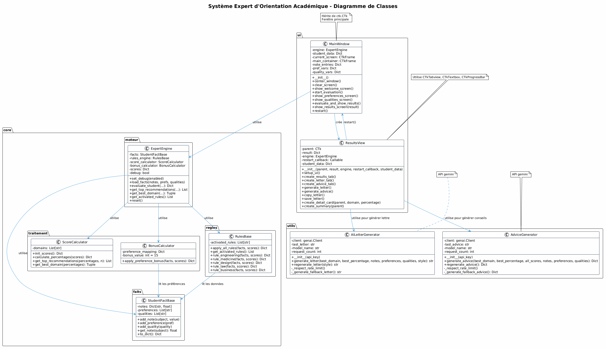
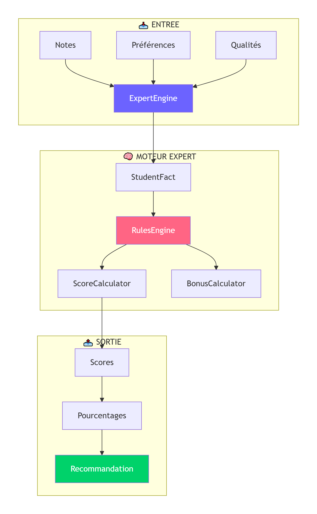

# 🎓 Système Expert d'Orientation Académique

## 📖 Description

Ce projet est un **système expert** d'orientation académique qui aide les étudiants à choisir leur filière d'études (Ingénierie, Médecine, Design, Droit, Commerce) en fonction de :
- Leurs notes scolaires
- Leurs centres d'intérêt
- Leurs qualités personnelles

Le système utilise un **moteur d'inférence à chaînage avant** (forward chaining) et peut générer des **lettres de motivation** et des **conseils personnalisés** via l'API Gemini (Google) ou en mode offline.

---

## 🚀 Fonctionnalités

| Fonctionnalité | Description |
|----------------|-------------|
| 📊 **Évaluation personnalisée** | Analyse des notes, préférences et qualités |
| 🎯 **Recommandations** | Top 3 des filières avec pourcentages |
| 📝 **Lettre de motivation** | Générée par IA (Gemini) ou template offline |
| 💡 **Conseils personnalisés** | Plan d'action, formations, métiers |
| 📄 **Export PDF** | Sauvegarde des résultats |
| 🎨 **Interface moderne** | CustomTkinter (thème sombre) |

---

## 🏗️ Architecture du projet

```bash
orientation_expert/
│
├── main.py                          # Point d'entrée
│
├── core/                            # Cœur métier
│   ├── faits/
│   │   ├── __init__.py
│   │   └── student_fact.py          # Base de faits (notes, préférences, qualités)
│   ├── regles/
│   │   ├── __init__.py
│   │   └── rules_engine.py          # Moteur de règles (chaînage avant)
│   ├── traitement/
│   │   ├── __init__.py
│   │   ├── score_calculator.py      # Calcul des scores et pourcentages
│   │   └── bonus_calculator.py      # Bonus liés aux préférences
│   └── moteur/
│       ├── __init__.py
│       └── expert_engine.py         # Orchestrateur principal
│
├── utils/                           # Utilitaires
│   ├── letter_generator.py          # Génération de lettres (IA + offline)
│   └── advice_generator.py          # Génération de conseils (IA + offline)
│
├── ui/                              # Interface utilisateur (CustomTkinter)
│   ├── __init__.py
│   ├── styles.py                    # Thème (couleurs, polices, tailles)
│   ├── main_window.py               # Fenêtre principale
│   └── results_view.py              # Vue des résultats (onglets)
│
└── requirements.txt                 # Dépendances

```
## 📊 Diagrammes
 ### 🔹 Diagramme de classes
   

 ### 🔹 Architecture et communication
   

## 🔧 Installation
 **clonage du projet:**
``` bash
 git clone https://github.com/votre-repo/orientation_expert.git
 cd orientation_expert
 ```
  **installation du dependance :**
 ``` bash 
 pip install -r requirments.txt
 ```
  **demarage du projet :**
 ``` bash 
 python main.py
 ```
 ```mermaid
 flowchart TD
    subgraph Frontend["🖥️ Frontend"]
        A[React.js]
        B[CustomTkinter]
    end
    
    subgraph Backend["⚙️ Backend"]
        C[Python 3.14]
        D[FastAPI]
        E[CLIPS Engine]
    end
    
    subgraph Database["🗄️ Database"]
        F[MySQL]
    end
    
    subgraph AI["🤖 IA"]
        G[Google Gemini API]
    end
    
    subgraph DevOps["🐳 DevOps"]
        H[Docker]
    end
    
    Frontend --> Backend
    Backend --> Database
    Backend --> AI
    Backend --> DevOps
```

```javascript
 console.log("hello");
 dddf
 ```
 [Texte du lien](https://exemple.com "Titre qui apparaît au survol")


